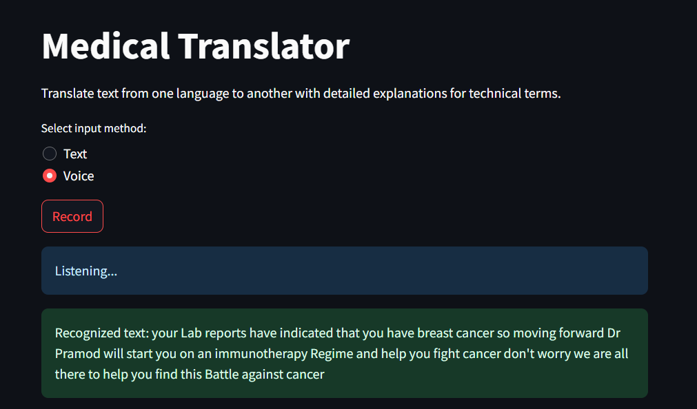
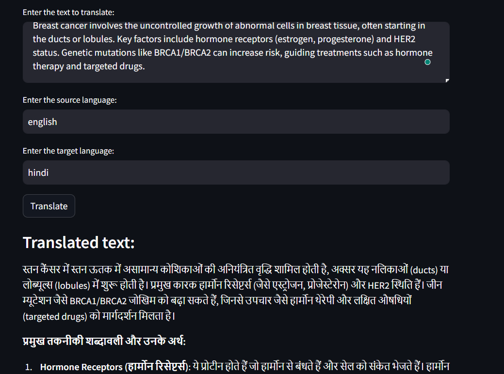
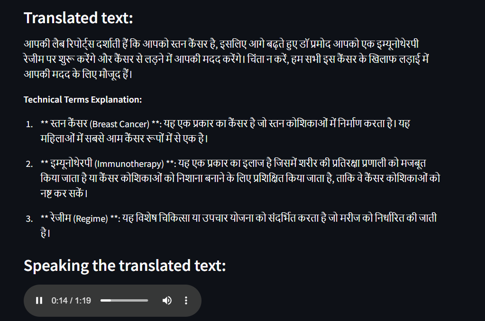

# Resilience AI! 
## Smart Support for Your Cancer Care 🩺🍀

## Overview

In cancer care, patients and caregivers often struggle to comprehend diagnostic procedures and treatment choices. This project proposes a GenAI-based interactive oncology resource specifically designed for breast cancer patients and caregivers. The resource aims to enhance understanding, provide emotional support, and streamline the management of health information.

## Features

### For Patients 🤒🏥

1. **Medical Translator**  
   Provides language translation with detailed explanations of technical terms to enhance understanding across languages.

2. **Vital Reminder**  
   Upload a PDF file with your appointments and important dates to seamlessly integrate them into your Google Calendar.

3. **Health Buddy**  
   A chatbot designed to answer all your health-related questions.

4. **Emotional Support Bot**  
   Includes comprehensive explanations, potential treatment paths, and helpful tips for understanding the breast cancer journey.

5. **Lab Report Analyser**, **Medication Analyser**, **MedInsight**, **EHR Analyser**  
   Analyze and understand reports, prescriptions, treatments, and electronic health records (EHR) through summaries and Q&A.

6. **Health Fit Advisor**  
   Personalized diet plans, exercise routines, and lifestyle changes to help adapt to new health requirements.

7. **Symptoms Monitoring**  
   Monitor symptoms and recognize changes in recovery during treatment.

8. **Patient Track**  
   Track health and progress throughout treatment.

9. **Information Hub**  
   Comprehensive information about breast cancer and its management.

10. **HealthMap**  
    Visualize treatment schedules for clarity and ease of understanding.

### For Doctors 👨🏻‍⚕️

1. **Clinical Assessment Advisor**  
   Assists doctors in formulating clinical diagnoses using electronic health records (EHRs) and patient symptoms.

## Project Status
The initial phase of the project was successfully developed and showcased at **GE Healthcare's Precision Care Challenge 2024, where it secured 2nd place.** It is now undergoing further development to enhance its capabilities.
While the application functions as intended and screenshots are available to demonstrate its features, the source code is not going to be provided yet.

## Screenshots

  

  

    

## Contributing

Contributions are welcome! If you have suggestions for features or improvements, please open an issue or submit a pull request.

## License

This project is licensed under the MIT License.